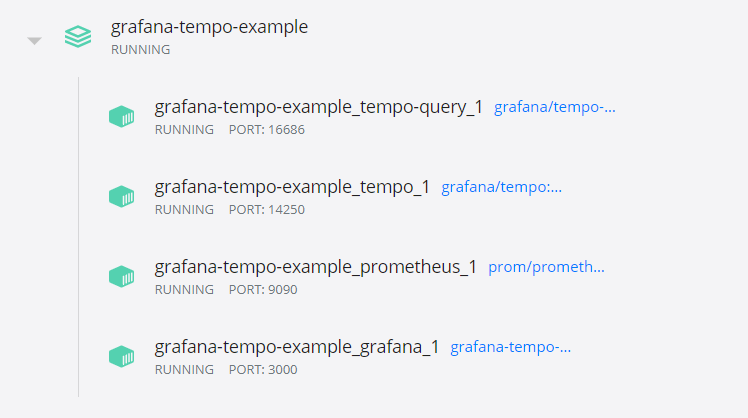
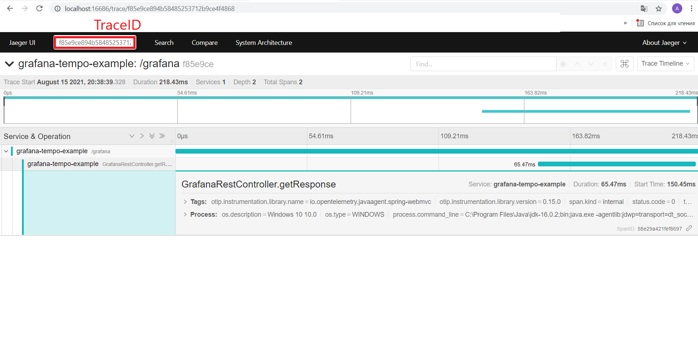

# grafana-tempo-example

Spring application demonstrating tracing using Grafana, Grafana Tempo, Jaeger, OpenTelemetry, Java 16.

### Run with VM Options

-javaagent:agent/opentelemetry-javaagent-all.jar \
-Dotel.trace.exporter=otlp \
-Dotel.exporter.otlp.endpoint=http://localhost:55680  \
-Dotel.resource.attributes=service.name=grafana-tempo-example \
-Dotel.javaagent.debug=false \
-Dotel.metrics.exporter=none 


### Starting Jaeger, Grafana Tempo, Grafana

```sh
docker-compose build
docker-compose up -d
```


Jaeger UI http://localhost:16686


Grafana UI http://localhost:3000


### Application Endpoint

GET http://localhost:8080/grafana \
Response Body: response


Jaeger UI



Grafana UI


JVM Metrics Dashboard


Micrometer Spring Throughput


### Links

Agent download link https://github.com/open-telemetry/opentelemetry-java-instrumentation/releases/tag/v0.15.0 \
https://reachmnadeem.wordpress.com/2021/02/06/opentelemetry-automatic-instrumentation-of-spring-boot-application-with-grafana-tempo-otlp-port/ \
https://github.com/mnadeem/boot-opentelemetry-tempo \
https://github.com/open-telemetry/opentelemetry-java/blob/main/sdk-extensions/autoconfigure/README.md#jaeger-exporter \
https://reachmnadeem.wordpress.com/2021/01/28/distributed-tracing-using-grafana-tempo-up-and-running-in-windows/